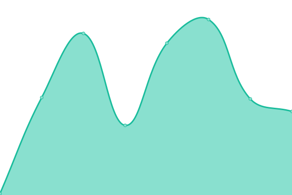
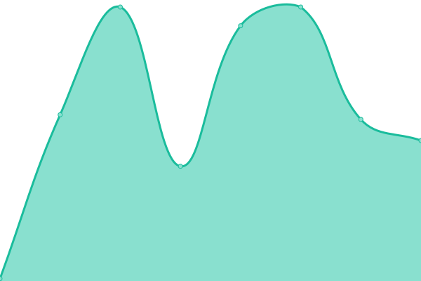
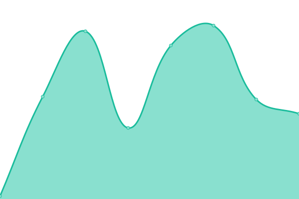
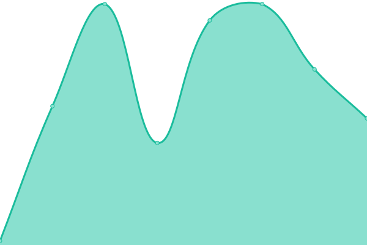

# [📈 Live Status](https://demo.upptime.js.org): <!--live status--> **🟧 Partial outage**

This repository contains the open-source uptime monitor and status page for [Upptime](https://upptime.js.org), powered by [Upptime](https://github.com/upptime/upptime).

With [Upptime](https://upptime.js.org), you can get your own unlimited and free uptime monitor and status page, powered entirely by a GitHub repository. We use [Issues](https://github.com/upptime/upptime/issues) as incident reports, [Actions](https://github.com/a116inc/status/actions) as uptime monitors, and [Pages](https://demo.upptime.js.org) for the status page.

<!--start: status pages-->
<!-- This summary is generated by Upptime (https://github.com/upptime/upptime) -->
<!-- Do not edit this manually, your changes will be overwritten -->
<!-- prettier-ignore -->
| URL | Status | History | Response Time | Uptime |
| --- | ------ | ------- | ------------- | ------ |
|  A116 Server 101 | 🟩 Up | [a116-server-101.yml](https://github.com/a116inc/status/commits/HEAD/history/a116-server-101.yml) | 

 104ms
     
 | 

<a href="https://status.a116.com.br/history/a116-server-101">100.00%</a>
    

|  A116 Server 102 | 🟩 Up | [a116-server-102.yml](https://github.com/a116inc/status/commits/HEAD/history/a116-server-102.yml) | 

 103ms
     
 | 

<a href="https://status.a116.com.br/history/a116-server-102">100.00%</a>
    

|  A116 Server 201 | 🟩 Up | [a116-server-201.yml](https://github.com/a116inc/status/commits/HEAD/history/a116-server-201.yml) | 

 304ms
     
 | 

<a href="https://status.a116.com.br/history/a116-server-201">97.50%</a>
    

|  A116 Server 301 | 🟥 Down | [a116-server-301.yml](https://github.com/a116inc/status/commits/HEAD/history/a116-server-301.yml) | 

 0ms
     
 | 

<a href="https://status.a116.com.br/history/a116-server-301">0.00%</a>
    

|  A116 Server 401 | 🟩 Up | [a116-server-401.yml](https://github.com/a116inc/status/commits/HEAD/history/a116-server-401.yml) | 

 97ms
     
 | 

<a href="https://status.a116.com.br/history/a116-server-401">100.00%</a>
    

|  A116 Server 402 | 🟩 Up | [a116-server-402.yml](https://github.com/a116inc/status/commits/HEAD/history/a116-server-402.yml) | 

 110ms
     
 | 

<a href="https://status.a116.com.br/history/a116-server-402">100.00%</a>
    

|  A116 Server 501 | 🟩 Up | [a116-server-501.yml](https://github.com/a116inc/status/commits/HEAD/history/a116-server-501.yml) | 

 56ms
     
 | 

<a href="https://status.a116.com.br/history/a116-server-501">100.00%</a>
    

|  A116 Server 502 | 🟩 Up | [a116-server-502.yml](https://github.com/a116inc/status/commits/HEAD/history/a116-server-502.yml) | 

 48ms
     
 | 

<a href="https://status.a116.com.br/history/a116-server-502">100.00%</a>
    

|  [dChat Server](https://dchat.com.br) | 🟩 Up | [d-chat-server.yml](https://github.com/a116inc/status/commits/HEAD/history/d-chat-server.yml) | 

 342ms
     
 | 

<a href="https://status.a116.com.br/history/d-chat-server">100.00%</a>
    

|  A116 Osiris Server | 🟩 Up | [a116-osiris-server.yml](https://github.com/a116inc/status/commits/HEAD/history/a116-osiris-server.yml) | 

 1014ms
     
 | 

<a href="https://status.a116.com.br/history/a116-osiris-server">100.00%</a>
    

<!--end: status pages-->

[**Visit our status website →**](https://demo.upptime.js.org)

## 📄 License

- Powered by: [Upptime](https://github.com/upptime/upptime)
- Code: [MIT](./LICENSE) © [Upptime](https://upptime.js.org)
- Data in the `./history` directory: [Open Database License](https://opendatacommons.org/licenses/odbl/1-0/)
